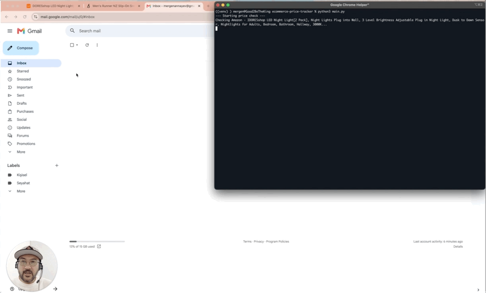

# Automated E-commerce Price Tracker

## What it does
This tool tracks product prices on Amazon and Shopify for you. It automatically visits websites, checks the current price, and compares it to a target price you set. If the price drops to where you want it, it sends you an email alert immediately. It’s perfect for tracking competitor pricing or getting notified when something you want to buy goes on sale.

## Demo
[Watch the price tracker in action on Loom](https://www.loom.com/share/72c2e432287d40ec9caaab871e5ac46a)

## Why use this?
*   **Saves time:** No more checking websites manually every single day.
*   **Stay ahead:** Get notified the second a price drops.
*   **Reliable:** It uses a stealth browser to avoid being blocked by strict websites like Amazon.

## What's inside
- **Python** (the language I used)
- **Selenium** (to open the website like a real person)
- **BeautifulSoup** (to quickly find the price on the page)
- **Dotenv** (to keep your email passwords safe and private)

## Realistic Expectations
Websites like Amazon and Shopify try hard to stop scrapers. 
- For a small number of checks (e.g., a few dozen a day), this script works well. 
- If you need to check hundreds of products or do it very frequently, the websites may block the script.
- If that happens, we can update the code to use professional scraping services (like rotating proxies or specialized scraping APIs) to stay reliable.

## How to use it (100% Foolproof Steps)

### 1. Set up the Tracker
1.  Clone this repository:
    `git clone https://github.com/YOUR-USERNAME/ecommerce-price-tracker.git`
2.  Navigate to the folder:
    `cd ecommerce-price-tracker`
3.  Install the tools by running: 
    `pip install -r requirements.txt`
4.  Find the file named `.env.example`, make a copy of it, and rename the copy to `.env`.
5.  Open your new `.env` file and fill in your email settings (you will need an "App Password" if you use Gmail).

### 2. Add your products
1.  Open `products.json`.
2.  Add the URL of the product you want to track, the platform (amazon or shopify), and your target price.

### 3. Run the Bot
1.  Make sure you have the Chrome browser installed.
2.  In your terminal, run: `python main.py`
3.  Sit back and watch the script check the prices for you!

## Need help?
If you need help setting this up for your own products, you can find me on Upwork. I can help you scrape other websites or fix this script if it breaks.
